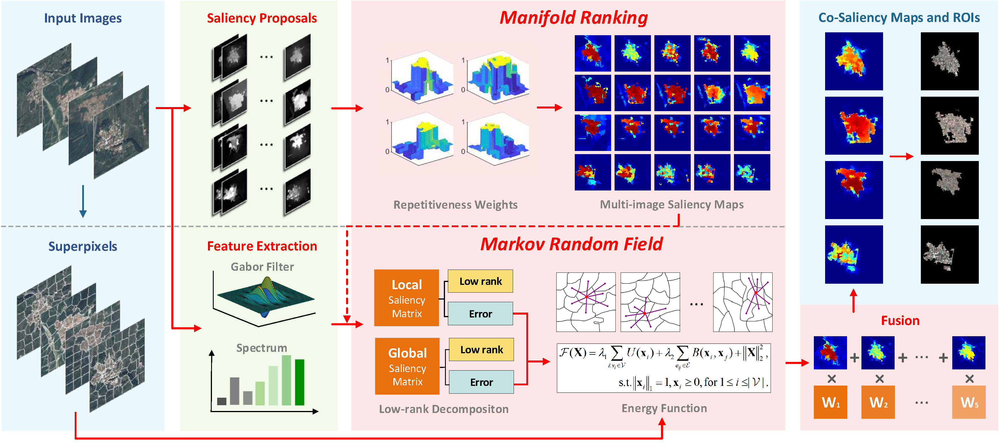

# CSMRF: COSALIENCY DETECTION AND ROI EXTRACTION via MANIFOLD RANKING AND MRF IN RSIs

L. Zhang, H. Wu

## Usage

- Please download the "CVX" and get the license file from "http://cvxr.com/cvx/download", and then install the cvx toolbox to `utils/cvx-w64`.
- Run main.m

## Cite

L. Zhang and H. Wu, "Cosaliency Detection and Region-of-Interest Extraction via Manifold Ranking and MRF in Remote Sensing Images," in IEEE Transactions on Geoscience and Remote Sensing, doi: 10.1109/TGRS.2021.3079441.